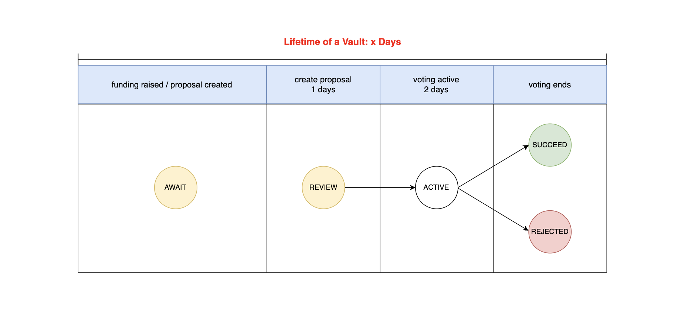

## D4N

**D4N represents "DAO for NFT"**

### Description
- This project aims to collect assets altogether and executes some good ideas on NFT.

### Framework
This project consists of two distinct modules: the **Central** and **Vault** modules.
- The Central module serves as the project's core, responsible for organizing and managing proposals submitted by various users. It oversees the entire process, facilitating the creation of vaults for a collective group of investors. On the other hand, each Vault operates as an independent entity, connecting to a specific NFT AMM pool provided by **sudoswap**. Every vault is associated with a target NFT and the corresponding NFT pool for interaction. Users can collectively propose and govern the usage of their shared NFTs through proposals in the vault.


- Once a Vault is created, it signifies that it has reached the target price outlined in its proposal. At this point, the Central contract executes the purchase of an NFT for the Vault. Investors associated with this Vault are then entitled to receive their voting tokens, enabling them to collectively govern the NFT through the submission of various proposals.


- Proposals in the Vault follows a standardized lifecycle with a duration of 3 days. The initial day is dedicated to proposal submission and review, while the subsequent two days are allocated for voting. After the voting period concludes, the proposal is executed based on the majority of either for or against votes. A critical condition for execution is that the winning side must secure more than 50% of the total vote count.



### Development
make sure editing .env file with
```sh
MAINNET_RPC_URL=[your_mainnet_rpc_url]
```

### Testing
make sure editing .env file with
```sh
MAINNET_RPC_URL=[your_mainnet_rpc_url]
```
```sh
cd D4N
forge install
forge test -vvvvv
```

- test

- test coverage
